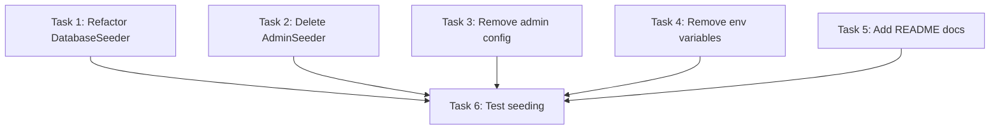

# Implementation Plan: Fix Seeder 500 Error and Refactor Admin Seeding

**Status:** Ready  
**Created:** 2025-01-XX

## Overview

This implementation plan fixes the 500 Internal Server Error caused by the admin seeding process. The solution consolidates admin user creation into `DatabaseSeeder`, removes environment variable dependencies, deletes the `AdminSeeder` class, and adds security documentation.

The changes are low-risk, primarily involving code reorganization rather than schema changes. The implementation is designed to be idempotent and production-safe.

## Tasks

- [x] 1. Refactor DatabaseSeeder with inline admin creation
  - Modify `database/seeders/DatabaseSeeder.php` to include inline admin user creation
  - Import required classes: User, Hash, Carbon, Role
  - Remove `AdminSeeder::class` from `$this->call()` array
  - Create new private method `seedAdminUser()` that:
    - Creates admin with email `Piton@gmail.com` and password `piton_admin@2025`
    - Uses `User::updateOrCreate()` for idempotency
    - Hashes password with `Hash::make()`
    - Sets `email_verified_at` to `Carbon::now()`
    - Verifies admin role exists with `Role::where('name', User::ROLE_ADMIN)->first()`
    - Assigns admin role using `$admin->assignRole($adminRole)` if not already assigned
    - Outputs credentials to console with security warning
    - Handles missing role gracefully with error message
  - Call `seedAdminUser()` after `RolePermissionSeeder::class` and before other seeders

- [x] 2. Delete AdminSeeder file
  - Delete file `database/seeders/AdminSeeder.php`
  - Verify no other files import or reference `AdminSeeder`

- [x] 3. Remove admin configuration from config file
  - Edit `config/conference.php`
  - Remove the entire `'admin' => [...]` array section
  - Ensure remaining config syntax is valid (proper commas, array structure)
  - Verify no code references `config('conference.admin.*')`

- [x] 4. Remove admin environment variables
  - Edit `.env` file
  - Remove `ADMIN_NAME` variable
  - Remove `ADMIN_EMAIL` variable
  - Remove `ADMIN_PASSWORD` variable
  - Check and update `.env.example` if these variables exist there

- [x] 5. Add security documentation to README
  - Edit `README.md`
  - Add "Initial Setup & Security" section with:
    - Database seeding instructions (`php artisan migrate:fresh --seed`)
    - Default admin credentials (email: `Piton@gmail.com`, password: `piton_admin@2025`)
    - Warning to change password after first login
    - Step-by-step instructions for changing password
    - Production security best practices

- [x] 6. Test the seeding process
  - Run `php artisan migrate:fresh --seed` and verify:
    - Command completes without errors (no 500 error)
    - Admin user exists in database with email `Piton@gmail.com`
    - Password is hashed with bcrypt (starts with `$2y$`)
    - Admin has `admin` role in `model_has_roles` table
    - `email_verified_at` is set
    - Console displays credentials with security warning
  - Test idempotency by running `php artisan db:seed` again
    - Verify no duplicate admin created
    - Verify no errors occur
  - Test login functionality:
    - Log in with email `Piton@gmail.com` and password `piton_admin@2025`
    - Verify successful authentication
    - Verify admin has full application access
  - Database verification with `php artisan tinker`:
    - `User::where('email', 'Piton@gmail.com')->first()` returns admin user
    - `User::where('email', 'Piton@gmail.com')->first()->roles` shows admin role

## Task Dependency Graph

```json
{
  "waves": [
    {
      "name": "Implementation",
      "tasks": [1, 2, 3, 4, 5]
    },
    {
      "name": "Testing",
      "tasks": [6]
    }
  ]
}
```



**Dependency Notes:**
- Tasks 1-5 are independent and can be completed in any order or in parallel
- Task 6 (testing) depends on completion of all other tasks (Tasks 1-5)
- Task 1 is the most critical as it contains the main logic changes

**Recommended Execution Order:**
1. Task 1 (main implementation)
2. Tasks 2, 3, 4 (cleanup tasks, any order)
3. Task 5 (documentation)
4. Task 6 (comprehensive testing)

## Notes

### Implementation Details

**Task 1 - DatabaseSeeder Code Structure:**
```php
<?php

namespace Database\Seeders;

use App\Models\User;
use Carbon\Carbon;
use Illuminate\Database\Seeder;
use Illuminate\Support\Facades\Hash;
use Spatie\Permission\Models\Role;

class DatabaseSeeder extends Seeder
{
    public function run(): void
    {
        $this->call([RolePermissionSeeder::class]);
        $this->seedAdminUser();
        $this->call([TrackSeeder::class, CriterionSeeder::class]);
    }

    private function seedAdminUser(): void
    {
        $email = 'Piton@gmail.com';
        $password = 'piton_admin@2025';
        $name = 'Administrator';

        $adminRole = Role::where('name', User::ROLE_ADMIN)->first();
        
        if (!$adminRole) {
            $this->command->error('Admin role not found.');
            return;
        }

        $admin = User::updateOrCreate(
            ['email' => $email],
            [
                'name' => $name,
                'password' => Hash::make($password),
                'email_verified_at' => Carbon::now(),
            ]
        );

        if (!$admin->hasRole($adminRole)) {
            $admin->assignRole($adminRole);
        }

        $this->command->info("✓ Admin account ready");
        $this->command->info("  Email: {$email}");
        $this->command->info("  Password: {$password}");
        $this->command->warn("  ⚠ Change the password after first login!");
    }
}
```

**Task 3 - Config Cleanup:**
Remove this section from `config/conference.php`:
```php
'admin' => [
    'name' => env('ADMIN_NAME', 'Administrator'),
    'email' => env('ADMIN_EMAIL'),
    'password' => env('ADMIN_PASSWORD'),
],
```

**Task 4 - Environment Variables to Remove:**
```
ADMIN_NAME="Administrator"
ADMIN_EMAIL=piton@gmail.com
ADMIN_PASSWORD=piton_admin@123
```

### Risk Assessment

**Low Risk Changes:**
- Tasks 2, 4, 5 (file deletion, config cleanup, documentation)

**Medium Risk Changes:**
- Task 1 (main logic change, but well-tested pattern)
- Task 3 (config change, but unused config)

**Mitigation:**
- Task 6 provides comprehensive testing before deployment
- Changes are idempotent and safe to re-run
- No database schema changes required
- Easy rollback via git revert

### Testing Checklist

**Pre-Deployment Testing:**
- [x] Fresh database seeding works
- [x] Idempotent re-seeding works
- [x] Admin login successful
- [x] Admin has correct role and permissions
- [x] No 500 errors occur
- [x] Console output is informative
- [x] Code passes linting/style checks

**Post-Deployment Verification:**
- [x] Existing users can still log in
- [x] No functionality regressions
- [x] Admin panel accessible
- [x] Logs show no errors

### Estimated Time

| Task | Estimated Time | Critical Path |
|------|----------------|---------------|
| Task 1 | 15-20 min | Yes |
| Task 2 | 1 min | No |
| Task 3 | 2 min | No |
| Task 4 | 2 min | No |
| Task 5 | 10 min | No |
| Task 6 | 10-15 min | Yes |
| **Total** | **40-50 min** | |

### Rollback Procedure

If issues are discovered after deployment:

1. Revert code changes: `git revert <commit-hash>`
2. Restore `AdminSeeder.php` from git history
3. Re-add ADMIN_* variables to `.env`
4. Restore admin config to `config/conference.php`
5. Clear caches: `php artisan config:clear && php artisan cache:clear`
6. Test seeding: `php artisan db:seed`

**Note:** Database changes (users table) do not need rollback as the new approach is backward compatible.

---

*This implementation plan follows the Kiro tasks.md specification format.*
